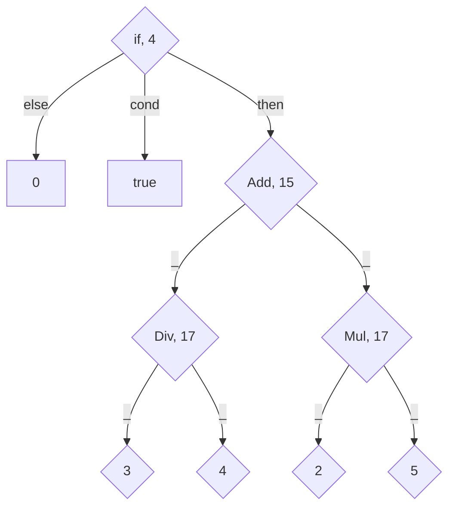

# Syntax

## Custom Syntax

**NOTE:** Older documentation on custom-syntax on [kast-lang.org](https://kast-lang.org/blog/ast/)


```hs
syntax "core:add" 15 wrap if_any = <- _ " "/"\n" "+" " " _;
```

1. `syntax`  
Start a syntax definition. `syntax` is actually the only keyword understood by Kast before more syntax is created

2. `"core:add"`  
The root of the syntax-node in the intermediate-representation tree that the matched syntax will represent. This node can then be used by the interpreter or compiler. `add` of-course represents addition

4. `wrap if_any`  
Tells the formatter how to format syntax matching this syntax definition TODO

5. `=`  
Indication that the syntax pattern begins after this

6. `<-`  
Tells the parser that the syntax is left-associative. In case the syntax was to be right-associative, the arrow should be present at the end, i.e. `syntax "core:add" 15 wrap if_any = _ " "/"\n" "+" " " _ ->;`

7. `_`  
An unnamed value part.
Placeholder for whatever sub-expressions might TODO. When the syntax is constructed, all the `_` are present as unnamed items of a tuple

8. `" "/"\n"`  
A whitespace part
Tells the formatter what should be inserted at this position in the syntax
Note that whitespace isn't actually matched during the parsing stage, and is only used by the formatter

9. `"+"`  
Matches the literal 'plus' symbol "+"

10. `" "`  
A whitespace part

11. `_`  
Another unnamed value part

3. `15`  
The priority of this syntax-definition over nested syntax-definitions. We saw that the `_` will be substituted with other syntax nodes. If a node that is being considered to go and substitute the `_` has a lower priority than this one, i.e. lower than 15, then the connection will be flipped, i.e. this node will become the child of that node, since this syntax binds its values tigther to itself than the other one

`if true then 3 * 4 + 2 * 5 else 0`


12. `;`  
End this syntax definition
